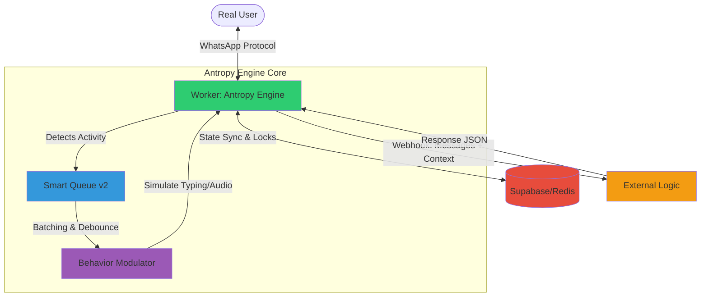

# WA Antropy Engine
### Human Behavior Simulation Framework for WhatsApp Automation

> **Anti-Detection Layer**: This framework acts as cognitive middleware between WhatsApp protocol and your business logic (n8n, custom backend, AI), injecting human-like imperfections, contextual latency, and non-deterministic behavioral patterns to evade automation detection systems.

---

## Table of Contents

- [Introduction](#introduction)
- [Key Features](#key-features)
- [Architecture](#architecture)
- [Installation](#installation)
- [Configuration](#configuration)
- [Core Capabilities](#core-capabilities)
- [API Reference](#api-reference)
- [Webhook Integration](#webhook-integration)
- [Multi-Worker Orchestration](#multi-worker-orchestration)
- [Advanced Usage](#advanced-usage)
- [Troubleshooting](#troubleshooting)
- [Contributing](#contributing)

---

## Introduction

**WA Antropy Engine** is a sophisticated worker orchestrator designed to inject "humanity" (entropy/anthropic behavior) into WhatsApp bots. Unlike traditional bots that respond instantly with fixed patterns, this engine simulates the psychomotor behavior of a real human operating a mobile device.

The system doesn't just send messages—it "reads," "thinks," "types," "records voice notes," and "sleeps" following circadian rhythms and conversational contexts, making bot activity virtually indistinguishable from a human operator.

### Why "Antropy"?

The name combines "Anthropic" (human-like) with "Entropy" (unpredictability). The engine introduces controlled randomness and human behavioral patterns to avoid statistical fingerprinting by anti-bot systems.

---

## Key Features

### 1. Advanced Human Behavior Simulation
- **Reading Time Calculation**: Based on character count and media type
- **Typing Simulation**: Gaussian distribution for realistic timing (not fixed delays)
- **Intermittent Typing**: Pauses, restarts, and "thinking" moments
- **Recording Indicator**: Simulates voice note recording for audio responses
- **Behavioral Variation**: Changes "personality" every N messages to avoid patterns
- **Typo Probability**: Optional simulated typos and corrections

### 2. Smart Queue v2 with Activity Detection
- **Active Listening**: Detects when user is typing/recording and pauses processing
- **Intelligent Batching**: Groups multiple short messages into single context
- **Automatic Pause/Resume**: Waits for user to finish their thought before responding
- **Context Switching**: Realistic delays when switching between different users
- **Debouncing**: Prevents premature responses to incomplete messages

### 3. Circadian Rhythm Simulation
- **Timezone-Aware**: Configurable timezone for realistic day/night cycles
- **Sleep Mode** (1-5 AM): 2.5x slowdown factor or message ignoring
- **Night Mode** (10 PM - 7 AM): 1.4x slowdown for tired/distracted behavior
- **Adaptive Response Times**: All timings adjust based on time of day

### 4. Reaction System
- **Contextual Reactions**: Occasionally reacts to messages with emojis
- **Probability-Based**: Configurable probability (default: 8%)
- **Emoji Pools**: Different emoji sets for positive vs. acknowledgment
- **Natural Timing**: Delays before reacting (300-1200ms)

### 5. Advanced Multimedia Handling
- **Media Download & Storage**: Automatic download and temporary storage
- **Audio Conversion**: Automatic conversion to OGG Opus format (WhatsApp native)
- **FFmpeg Integration**: Professional audio encoding with voice optimization
- **Base64 Support**: Accepts audio from webhooks as base64
- **Viewing Time Simulation**: Adds time for "viewing" images/videos
- **Auto-Cleanup**: Automatic deletion of old media files

### 6. Multi-Worker Orchestration (Supabase)
- **Distributed Locks**: Prevents message duplication across workers
- **Cross-Worker Messages**: Workers can assist each other for variability
- **Heartbeat System**: Detects and recovers from dead workers
- **Automatic Failover**: Reassigns conversations if worker dies
- **Statistics Dashboard**: Real-time orchestration stats via API

### 7. External Business Logic Integration
- **Webhook Architecture**: Delegates decision-making to external systems
- **Universal Compatibility**: Works with n8n, Make.com, Zapier, custom APIs
- **Multiple Response Formats**: Supports text, audio, multiple messages
- **Timeout Handling**: Configurable timeouts with graceful fallbacks
- **Rich Context**: Sends complete message context including media URLs

### 8. Anti-Detection Features v4.2
- **Gaussian Jitter**: All timings use gaussian distribution, not fixed values
- **Seen/Read Receipts**: Sends "seen" with natural delays
- **Quote Intelligence**: Intelligently decides when to quote messages
- **State Management**: Proper WhatsApp presence states (typing/recording)
- **No Mathematical Patterns**: Avoids perfectly regular intervals
- **Behavioral Fingerprint Rotation**: Changes timing patterns periodically

---

## Architecture

The system uses a distributed architecture where workers handle WhatsApp sessions and behavior simulation, while delegating business logic to external systems and state to a real-time database.



### Processing Flow

1. **Reception & Active Listening (Smart Queue v2)**
   - System receives a message but doesn't process immediately
   - **Active Listening**: If user is `typing` or `recording`, worker pauses to avoid interrupting
   - **Batching**: Groups multiple short messages into a single logical context
   - **Timeout Safety**: Maximum wait time to prevent indefinite delays

2. **Cognitive Simulation (Behavior Modulator)**
   - Calculates reading time based on text length and media type
   - Determines typing/recording time using gaussian distributions
   - Applies "Jitter" (random variation) to avoid exact mathematical patterns
   - Adjusts all timings based on time of day (circadian rhythms)

3. **Response Execution**
   - Simulates presence states (`composing`, `recording`)
   - Sends final response with natural timing
   - Handles multiple messages with delays between each
   - Optionally quotes original message based on context

---

## Installation

### Prerequisites

- **Node.js**: v18.0.0 or higher
- **FFmpeg**: Required for audio encoding/manipulation (OGG Opus conversion)
- **Supabase Project**: For multi-worker orchestration (optional for single worker)
- **Google Chrome**: For WhatsApp Web protocol (puppeteer)

### Step-by-Step Installation

1. **Clone the repository**
   ```bash
   git clone <repository-url>
   cd wa-antropy-engine
   ```

2. **Install dependencies**
   ```bash
   npm install
   ```

3. **Install FFmpeg**

   **Debian/Ubuntu:**
   ```bash
   sudo apt update && sudo apt install -y ffmpeg
   ```

   **macOS:**
   ```bash
   brew install ffmpeg
   ```

   **Windows:**
   Download from [ffmpeg.org](https://ffmpeg.org/download.html) and add to PATH

4. **Install Google Chrome** (for Puppeteer)

   **Debian/Ubuntu:**
   ```bash
   wget https://dl.google.com/linux/direct/google-chrome-stable_current_amd64.deb
   sudo dpkg -i google-chrome-stable_current_amd64.deb
   sudo apt-get install -f
   ```

5. **Configure environment**
   ```bash
   cp .env.example .env
   nano .env  # Edit with your configuration
   ```

6. **Set up Supabase database** (see [Multi-Worker Orchestration](#multi-worker-orchestration))

7. **Run the worker**
   ```bash
   npm start
   ```

8. **Scan QR code**
   - QR code will appear in terminal
   - Scan with WhatsApp mobile app
   - Wait for "WhatsApp conectado" message

---

## Configuration

### Environment Variables

| Variable | Required | Description | Example |
|----------|----------|-------------|---------|
| `PORT` | Yes | Worker HTTP server port | `3001` |
| `WORKER_ID` | Yes | Unique worker identifier | `worker-1` |
| `BOT_NAME` | No | Display name for logs | `MyBot` |
| `BASE_PATH` | No | API route prefix | `/api/wa-antropy` |
| `SUPABASE_URL` | Yes | Supabase project URL | `https://xxx.supabase.co` |
| `SUPABASE_SERVICE_ROLE_KEY` | Yes | Supabase service role key | `eyJ...` |
| `N8N_WEBHOOK_URL` | Yes | Business logic webhook URL | `https://n8n.example.com/webhook/wa` |
| `N8N_TIMEOUT` | No | Webhook timeout (ms) | `120000` |
| `PUBLIC_MEDIA_URL` | Yes | Public URL for media files | `https://your-domain.com` |
| `MEDIA_DIR` | No | Local media storage path | `./media` |
| `TIMEZONE` | No | IANA timezone identifier | `America/New_York` |

### Behavioral Configuration

All behavior parameters are configured in `config/index.js` under `HUMAN_BEHAVIOR_CONFIG`:

#### Reading Behavior
```javascript
reading: {
  baseTimeMs: 920,              // Base reading time
  msPerCharacter: 52,            // Time per character
  maxReadingTimeMs: 4600,        // Maximum reading time
  jitterPercent: 0.3,            // Random variation (30%)
  imageViewTimeMs: [2000, 4000], // Image viewing range
  videoViewTimeMs: [3000, 6000], // Video viewing range
  audioListenTimeMs: [1500, 3500] // Audio listening range
}
```

#### Typing Behavior
```javascript
typing: {
  msPerCharacter: 40,            // Typing speed
  minTypingTimeMs: 2300,         // Minimum typing time
  maxTypingTimeMs: 52000,        // Maximum typing time
  jitterPercent: 0.25,           // Random variation (25%)
  absoluteMaxTypingMs: 180000    // Safety limit (3 minutes)
}
```

#### Smart Queue Configuration
```javascript
smartQueue: {
  enabled: true,
  baseWindowMs: 4000,            // Wait window after inactivity
  mediaWindowMs: 5000,           // Extended wait for media
  maxWaitTimeMs: 30000,          // Maximum total wait time
  maxBatchSize: 8,               // Max messages per batch
  contextSwitchDelayMs: [1500, 3500] // Delay when switching users
}
```

#### Circadian Rhythm
```javascript
schedule: {
  enabled: true,
  timezone: 'America/New_York',
  sleepHoursStart: 1,            // 1 AM
  sleepHoursEnd: 5,              // 5 AM
  sleepSlowdownFactor: 2.5,      // 2.5x slower responses
  nightHoursStart: 22,           // 10 PM
  nightHoursEnd: 7,              // 7 AM
  nightSlowdownFactor: 1.4       // 1.4x slower responses
}
```

---

## Core Capabilities

### 1. Smart Queue with Activity Detection

The Smart Queue v2 is the core innovation that makes interactions feel human.

**How it works:**

1. User sends message → Timer starts (4 seconds)
2. User starts typing → Timer PAUSES
3. User stops typing → Timer RESTARTS (4 seconds from now)
4. Timer expires without activity → Batch is FLUSHED and processed

**Example Scenario:**
```
10:00:00 - User sends "Hello"
         → Timer: 4s
10:00:01 - User starts typing
         → Timer: PAUSED
10:00:03 - User sends "How are you?"
         → Timer: still PAUSED (user might send more)
10:00:04 - User stops typing
         → Timer: RESTART 4s
10:00:08 - Timer expires
         → FLUSH: Process both "Hello" + "How are you?" as single context
```

### 2. Behavior Variation System

To avoid statistical fingerprinting, the engine varies its behavior every N messages (default: 5).

**What varies:**
- Typing speed (WPM)
- Reading speed
- Pause probabilities
- Reaction likelihood
- Timing jitter amounts

**Variation Range:** ±15% by default (configurable)

This means the bot doesn't have a "fixed personality" that could be detected by analyzing timing patterns over multiple conversations.

### 3. Audio Response Simulation

The engine can respond with audio messages that sound like native WhatsApp voice notes.

**Process:**
1. Webhook returns `audio_base64` in response
2. Engine detects audio format (MP3, M4A, WAV, etc.)
3. FFmpeg converts to OGG Opus (WhatsApp native format)
4. Encoding parameters optimized for voice:
   - Bitrate: 24kbps
   - VBR mode
   - Frame duration: 60ms
   - Application: VOIP

**User Experience:**
- Shows "recording" indicator before sending
- Realistic delay (2-4 seconds)
- Audio appears as WhatsApp voice note (not file attachment)

### 4. Cross-Worker Messages

In multi-worker setups, workers occasionally "help" each other process messages for increased variability.

**Example:**
- Worker 1 handles User A
- Message from User A arrives
- 8% chance: Worker 2 processes this message instead
- User sees consistent conversation, but timing patterns vary

This prevents associating a specific "timing signature" with a specific phone number.

### 5. Reaction Intelligence

The system can react to messages with emojis, following human patterns.

**Reaction Decision Tree:**
```
Is reactions enabled? → No → Skip
Is message type reactable? → No → Skip
Random(0-1) < probability? → No → Skip
Is message positive/media? → Yes → Use positive emoji pool
Otherwise → Use acknowledgment emoji pool
Apply reaction with delay (300-1200ms)
```

**Emoji Pools:**
- **Positive**: 👍 😊 🙌 ✨ 💚
- **Acknowledgment**: 👀 🤔 📝

---

## API Reference

### Health Check

**Endpoint:** `GET {BASE_PATH}/health`

**Response:**
```json
{
  "status": "ok",
  "worker_id": "worker-1",
  "port": 3001,
  "version": "v4.2",
  "whatsapp_connected": true,
  "connected_number": "5215555555555@c.us",
  "smart_queue": {
    "totalProcessed": 145,
    "totalBatched": 38,
    "contextSwitches": 12,
    "crossWorkerMessages": 7,
    "mediaMessages": 23,
    "reactions": 11,
    "audioResponses": 3,
    "activityDetections": 67,
    "activityPauses": 15,
    "currentQueueLength": 0,
    "bufferedUsers": 1,
    "activeUsers": 0,
    "isProcessing": false
  },
  "media_url": "https://your-domain.com/api/wa-antropy/media/",
  "schedule": {
    "cr_hour": 14,
    "mode": "day",
    "slowdown_factor": 1.0
  },
  "features": {
    "smart_queue": true,
    "activity_detection": true,
    "reactions": true,
    "split_messages": true,
    "intermittent_typing": true,
    "audio_base64_support": true
  }
}
```

### Orchestration Stats

**Endpoint:** `GET {BASE_PATH}/orchestration/stats`

**Response:**
```json
{
  "active_workers": 3,
  "total_messages_processed": 1523,
  "total_locks": 12,
  "dead_workers": 0
}
```

### Send Message

**Endpoint:** `POST {BASE_PATH}/send-message`

**Request:**
```json
{
  "to": "+5215555555555",
  "message": "Hello from API"
}
```

**Response:**
```json
{
  "success": true,
  "phone": "+5215555555555",
  "worker": "worker-1"
}
```

### Send Audio

**Endpoint:** `POST {BASE_PATH}/send-audio`

**Request (with URL):**
```json
{
  "to": "+5215555555555",
  "audio_url": "https://example.com/audio.mp3"
}
```

**Request (with Base64):**
```json
{
  "to": "+5215555555555",
  "audio_base64": "data:audio/mpeg;base64,//uQx...",
  "audio_mimetype": "audio/mpeg"
}
```

**Response:**
```json
{
  "success": true,
  "phone": "+5215555555555",
  "worker": "worker-1"
}
```

---

## Webhook Integration

### Request Format (Worker → Your System)

When the worker processes a message, it sends this payload to your webhook:

```json
{
  "phone": "+5215555555555",
  "type": "text",
  "message": "User message content",
  "has_media": false,
  "media_count": 0,
  "media_list": [],
  "message_id": "3EB0C8F5E2F...",
  "timestamp": "2024-03-20T10:00:00Z",
  "bot_name": "MyBot",
  "worker_id": "worker-1",
  "cr_hour": 14,
  "is_sleep_time": false
}
```

**With Media:**
```json
{
  "phone": "+5215555555555",
  "type": "image",
  "message": "Check this out",
  "has_media": true,
  "media_count": 1,
  "media_list": [{
    "type": "image",
    "url": "https://your-domain.com/api/wa-antropy/media/abc123.jpg",
    "mimetype": "image/jpeg",
    "filename": "abc123.jpg",
    "size": 245678
  }],
  "media_url": "https://your-domain.com/api/wa-antropy/media/abc123.jpg",
  "media_type": "image/jpeg",
  "media_filename": "abc123.jpg",
  "media_size": 245678,
  "message_id": "3EB0C8F5E2F...",
  "timestamp": "2024-03-20T10:00:00Z",
  "bot_name": "MyBot",
  "worker_id": "worker-1"
}
```

### Response Format (Your System → Worker)

Your webhook must respond with one of these formats:

**Simple Text Response:**
```json
{
  "output": "This is the bot response"
}
```

**Multiple Messages:**
```json
{
  "output": [
    "First message",
    "Second message",
    "Third message"
  ]
}
```

**Audio Response (Base64):**
```json
{
  "type": "audio",
  "audio_base64": "data:audio/mpeg;base64,//uQx...",
  "audio_mimetype": "audio/mpeg",
  "output": "Audio response sent"
}
```

**Audio Response (URL):**
```json
{
  "type": "audio",
  "audio_url": "https://your-server.com/audio/response.mp3",
  "output": "Audio response sent"
}
```

**Alternative Field Names (Compatibility):**

The system accepts multiple field name variations:
- `output` / `reply` / `message` / `text` / `messages` / `replies`
- `audio_base64` (primary)
- `audio_mimetype` / `audio_mime`
- `audio_url` / `audioUrl`

### Webhook Examples

#### n8n Workflow
```json
// n8n HTTP Response Node
{
  "output": "{{ $json.ai_response }}",
  "type": "text"
}
```

#### Make.com / Integromat
```json
{
  "output": "{{1.response}}",
  "type": "text"
}
```

#### Custom Express API
```javascript
app.post('/webhook/whatsapp-processor', async (req, res) => {
  const { phone, message, type, media_url } = req.body;

  // Your business logic here
  const response = await processMessage(phone, message);

  res.json({
    output: response,
    type: 'text'
  });
});
```

#### OpenAI Integration Example
```javascript
app.post('/webhook/whatsapp', async (req, res) => {
  const { phone, message } = req.body;

  // Call OpenAI
  const completion = await openai.chat.completions.create({
    model: "gpt-4",
    messages: [
      { role: "system", content: "You are a helpful assistant" },
      { role: "user", content: message }
    ]
  });

  res.json({
    output: completion.choices[0].message.content
  });
});
```

---

## Multi-Worker Orchestration

### Supabase Database Setup

The multi-worker system requires three tables and several PostgreSQL functions.

#### 1. Create Tables

```sql
-- Workers table
CREATE TABLE wa_workers (
  worker_id TEXT PRIMARY KEY,
  port INTEGER,
  status TEXT DEFAULT 'active',
  created_at TIMESTAMPTZ DEFAULT NOW(),
  updated_at TIMESTAMPTZ DEFAULT NOW()
);

-- Message locks table
CREATE TABLE wa_message_locks (
  message_id TEXT PRIMARY KEY,
  phone TEXT NOT NULL,
  worker_id TEXT NOT NULL,
  created_at TIMESTAMPTZ DEFAULT NOW(),
  processed_at TIMESTAMPTZ,
  is_cross_worker BOOLEAN DEFAULT FALSE
);

-- Chat assignments table
CREATE TABLE wa_chat_assignments (
  phone TEXT PRIMARY KEY,
  assigned_worker TEXT NOT NULL,
  created_at TIMESTAMPTZ DEFAULT NOW(),
  updated_at TIMESTAMPTZ DEFAULT NOW(),
  message_count INTEGER DEFAULT 0
);
```

#### 2. Create Indexes

```sql
CREATE INDEX idx_message_locks_phone ON wa_message_locks(phone);
CREATE INDEX idx_message_locks_created ON wa_message_locks(created_at);
CREATE INDEX idx_workers_status ON wa_workers(status);
CREATE INDEX idx_chat_assignments_worker ON wa_chat_assignments(assigned_worker);
```

#### 3. Create PostgreSQL Functions

**Worker Heartbeat:**
```sql
CREATE OR REPLACE FUNCTION worker_heartbeat(
  p_worker_id TEXT,
  p_port INTEGER
)
RETURNS VOID AS $$
BEGIN
  INSERT INTO wa_workers (worker_id, port, status, updated_at)
  VALUES (p_worker_id, p_port, 'active', NOW())
  ON CONFLICT (worker_id)
  DO UPDATE SET
    status = 'active',
    updated_at = NOW(),
    port = p_port;
END;
$$ LANGUAGE plpgsql;
```

**Try Claim Message:**
```sql
CREATE OR REPLACE FUNCTION try_claim_message(
  p_message_id TEXT,
  p_phone TEXT,
  p_worker_id TEXT,
  p_allow_cross_worker BOOLEAN DEFAULT FALSE
)
RETURNS JSON AS $$
DECLARE
  v_existing_lock RECORD;
  v_chat_assignment RECORD;
  v_should_process BOOLEAN := FALSE;
  v_is_cross_worker BOOLEAN := FALSE;
  v_assigned_worker TEXT;
  v_reason TEXT;
BEGIN
  -- Check if message already locked
  SELECT * INTO v_existing_lock
  FROM wa_message_locks
  WHERE message_id = p_message_id;

  IF FOUND THEN
    RETURN json_build_object(
      'should_process', FALSE,
      'reason', 'already_locked',
      'assigned_worker', v_existing_lock.worker_id
    );
  END IF;

  -- Check chat assignment
  SELECT * INTO v_chat_assignment
  FROM wa_chat_assignments
  WHERE phone = p_phone;

  IF NOT FOUND THEN
    -- New chat, assign to this worker
    INSERT INTO wa_chat_assignments (phone, assigned_worker, message_count)
    VALUES (p_phone, p_worker_id, 1);

    v_should_process := TRUE;
    v_assigned_worker := p_worker_id;
    v_reason := 'new_chat';
  ELSE
    v_assigned_worker := v_chat_assignment.assigned_worker;

    IF v_chat_assignment.assigned_worker = p_worker_id THEN
      -- This worker owns this chat
      v_should_process := TRUE;
      v_reason := 'chat_assigned_to_me';

      -- Update message count
      UPDATE wa_chat_assignments
      SET message_count = message_count + 1,
          updated_at = NOW()
      WHERE phone = p_phone;
    ELSIF p_allow_cross_worker THEN
      -- Cross-worker processing allowed
      v_should_process := TRUE;
      v_is_cross_worker := TRUE;
      v_reason := 'cross_worker_allowed';
    ELSE
      -- Assigned to different worker
      v_should_process := FALSE;
      v_reason := 'chat_assigned_to_other_worker';
    END IF;
  END IF;

  -- Create lock if should process
  IF v_should_process THEN
    INSERT INTO wa_message_locks (message_id, phone, worker_id, is_cross_worker)
    VALUES (p_message_id, p_phone, p_worker_id, v_is_cross_worker);
  END IF;

  RETURN json_build_object(
    'should_process', v_should_process,
    'is_cross_worker', v_is_cross_worker,
    'assigned_worker', v_assigned_worker,
    'reason', v_reason
  );
END;
$$ LANGUAGE plpgsql;
```

**Mark Message Processed:**
```sql
CREATE OR REPLACE FUNCTION mark_message_processed(
  p_message_id TEXT,
  p_worker_id TEXT
)
RETURNS VOID AS $$
BEGIN
  UPDATE wa_message_locks
  SET processed_at = NOW()
  WHERE message_id = p_message_id
    AND worker_id = p_worker_id;
END;
$$ LANGUAGE plpgsql;
```

**Cleanup Old Data:**
```sql
CREATE OR REPLACE FUNCTION cleanup_old_data()
RETURNS JSON AS $$
DECLARE
  v_locks_deleted INTEGER;
  v_workers_dead INTEGER;
BEGIN
  -- Delete locks older than 1 hour
  DELETE FROM wa_message_locks
  WHERE created_at < NOW() - INTERVAL '1 hour';

  GET DIAGNOSTICS v_locks_deleted = ROW_COUNT;

  -- Mark workers dead if no heartbeat for 1 minute
  UPDATE wa_workers
  SET status = 'dead'
  WHERE updated_at < NOW() - INTERVAL '1 minute'
    AND status = 'active';

  GET DIAGNOSTICS v_workers_dead = ROW_COUNT;

  RETURN json_build_object(
    'locks_deleted', v_locks_deleted,
    'workers_marked_dead', v_workers_dead
  );
END;
$$ LANGUAGE plpgsql;
```

**Get Orchestration Stats:**
```sql
CREATE OR REPLACE FUNCTION get_orchestration_stats()
RETURNS JSON AS $$
DECLARE
  v_active_workers INTEGER;
  v_total_messages INTEGER;
  v_total_locks INTEGER;
  v_dead_workers INTEGER;
BEGIN
  SELECT COUNT(*) INTO v_active_workers
  FROM wa_workers WHERE status = 'active';

  SELECT COUNT(*) INTO v_dead_workers
  FROM wa_workers WHERE status = 'dead';

  SELECT COUNT(*) INTO v_total_messages
  FROM wa_message_locks WHERE processed_at IS NOT NULL;

  SELECT COUNT(*) INTO v_total_locks
  FROM wa_message_locks WHERE processed_at IS NULL;

  RETURN json_build_object(
    'active_workers', v_active_workers,
    'dead_workers', v_dead_workers,
    'total_messages_processed', v_total_messages,
    'total_locks', v_total_locks
  );
END;
$$ LANGUAGE plpgsql;
```

### Running Multiple Workers

```bash
# Terminal 1
PORT=3001 WORKER_ID=worker-1 npm start

# Terminal 2
PORT=3002 WORKER_ID=worker-2 npm start

# Terminal 3
PORT=3003 WORKER_ID=worker-3 npm start
```

Or use the convenience scripts:
```bash
npm run worker:1  # Port 3001
npm run worker:2  # Port 3002
npm run worker:3  # Port 3003
npm run worker:4  # Port 3004
```

---

## Advanced Usage

### Custom Timing Profiles

You can create different timing profiles for different use cases:

**Fast Profile (Customer Service):**
```javascript
// config/index.js
export const HUMAN_BEHAVIOR_CONFIG = {
  reading: {
    baseTimeMs: 500,
    msPerCharacter: 30,
    // ... faster timings
  }
}
```

**Slow Profile (Casual Chat):**
```javascript
export const HUMAN_BEHAVIOR_CONFIG = {
  reading: {
    baseTimeMs: 1500,
    msPerCharacter: 80,
    // ... slower timings
  }
}
```

### Conditional Behavior Based on User

You can modify the behavior based on the user in `worker.js`:

```javascript
async function processMessageWithHumanBehavior(message, identifier, realPhone, data) {
  // Check if this is a VIP user
  const isVIP = await checkIfVIP(realPhone);

  // Faster responses for VIPs
  let variationFactor = isVIP ? 0.5 : behaviorVariator.getVariationFactor(identifier);

  // Rest of processing...
}
```

### Integrating with CRM Systems

Example: Sync chat assignments with your CRM

```javascript
// In handleIncomingMessage
const crmContact = await fetchFromCRM(realPhone);
if (crmContact.assignedAgent) {
  // Route to specific worker based on CRM assignment
}
```

### Custom Media Processing

Example: Add watermarks to images before sending

```javascript
// In lib/media.js
export async function processImageBeforeSending(imagePath) {
  // Use sharp or jimp to add watermark
  const watermarked = await addWatermark(imagePath);
  return watermarked;
}
```

---

## Troubleshooting

### WhatsApp Won't Connect

**Issue:** QR code doesn't appear or connection fails

**Solutions:**
1. Check Chrome installation: `which google-chrome-stable`
2. Check puppeteer permissions
3. Delete auth folder: `rm -rf .wwebjs_auth_*`
4. Update whatsapp-web.js: `npm update whatsapp-web.js`

### Audio Conversion Fails

**Issue:** Audio messages fail with ffmpeg error

**Solutions:**
1. Verify ffmpeg installation: `ffmpeg -version`
2. Check audio format compatibility
3. Try with simpler audio first (MP3)
4. Check ffmpeg permissions
5. Review logs for specific error

### Messages Not Processing

**Issue:** Messages received but not processed

**Solutions:**
1. Check webhook URL is accessible
2. Verify Supabase connection
3. Check `N8N_WEBHOOK_URL` environment variable
4. Review worker logs for errors
5. Test webhook manually with curl

### Duplicate Messages

**Issue:** Same message processed multiple times

**Solutions:**
1. Verify Supabase orchestration is running
2. Check for multiple workers with same `WORKER_ID`
3. Review `wa_message_locks` table
4. Ensure proper network connectivity to Supabase

### High Memory Usage

**Issue:** Worker consumes too much RAM

**Solutions:**
1. Reduce `MEDIA_DIR` retention time
2. Implement media cleanup: `cleanupOldMedia()`
3. Limit `maxBatchSize` in Smart Queue config
4. Check for memory leaks in custom code
5. Monitor with: `node --inspect worker.js`

### Slow Response Times

**Issue:** Bot responds too slowly

**Solutions:**
1. Check `TIMEZONE` is set correctly
2. Review circadian rhythm settings
3. Reduce `baseTimeMs` and `msPerCharacter` values
4. Check webhook response time
5. Disable Smart Queue temporarily for testing

---

## Contributing

### Development Setup

```bash
# Install dependencies
npm install

# Run in development mode with auto-reload
npm run dev

# Run specific worker
npm run worker:1
```

### Code Structure

```
wa-antropy-engine/
├── config/
│   └── index.js          # All configuration
├── lib/
│   ├── behavior.js       # Behavior variation system
│   ├── queue.js          # Smart Queue v2
│   ├── typing.js         # Typing/recording simulation
│   ├── reactions.js      # Reaction system
│   ├── media.js          # Media handling & FFmpeg
│   ├── n8n.js            # Webhook integration
│   ├── supabase.js       # Multi-worker orchestration
│   └── utils.js          # Utility functions
├── worker.js             # Main worker entry point
├── .env.example          # Environment template
└── package.json          # Dependencies
```

### Testing

```bash
# Test single message
curl -X POST http://localhost:3001/api/wa-antropy/send-message \
  -H "Content-Type: application/json" \
  -d '{"to": "+1234567890", "message": "Test message"}'

# Test audio
curl -X POST http://localhost:3001/api/wa-antropy/send-audio \
  -H "Content-Type: application/json" \
  -d '{"to": "+1234567890", "audio_url": "https://example.com/test.mp3"}'

# Check health
curl http://localhost:3001/api/wa-antropy/health
```

### Roadmap

- [ ] Humor/Mood States (vary response length based on "mood")
- [ ] Dynamic Stickers based on sentiment analysis
- [ ] Native LLM integration for intent pre-processing
- [ ] Redis as alternative to Supabase
- [ ] WebSocket support for real-time updates
- [ ] Analytics dashboard
- [ ] A/B testing framework for timing profiles
- [ ] Machine learning for adaptive behavior optimization

---

## License

This software is proprietary. Usage is restricted to the terms of the license agreement.

---

## Support

For bugs, feature requests, or questions:
- Open an issue on GitHub
- Check existing documentation
- Review troubleshooting section

---

**Built with ❤️ for human-like automation**
